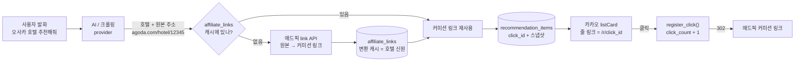
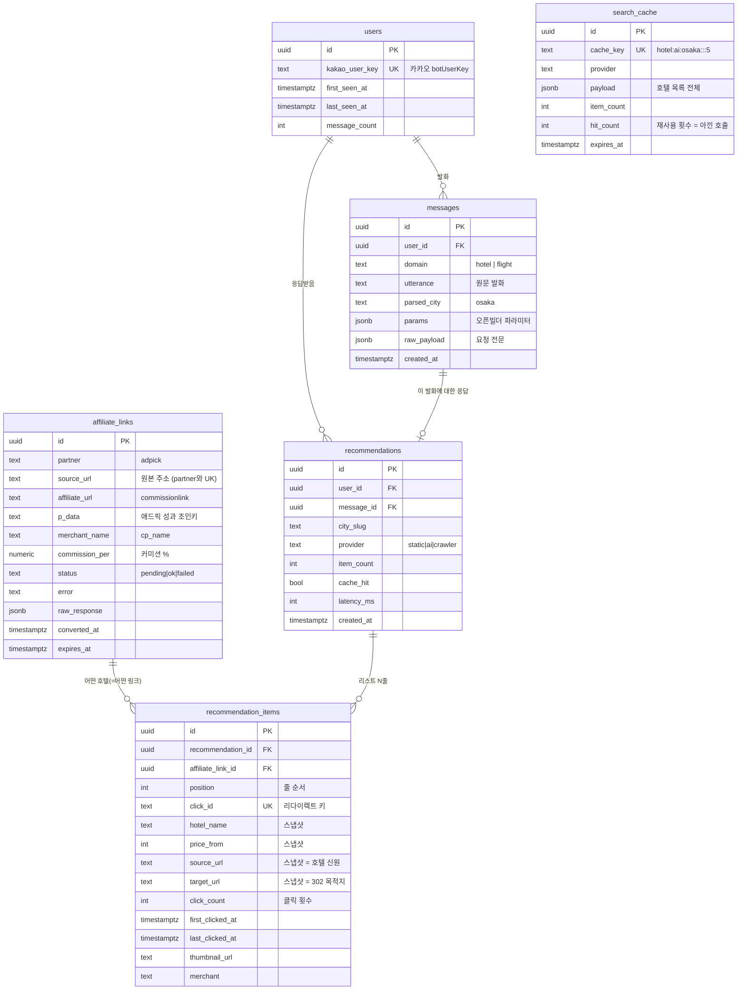

# DB 구조 — 무엇을 어떻게 저장하는가

정의 원본은 [`supabase/migrations/0001_init.sql`](../supabase/migrations/0001_init.sql) 하나뿐이다.
이 문서는 **어떤 데이터가 어느 시점에 어떤 행으로 남는지**를 설명한다.

> **전제**: 호텔 마스터 데이터를 소유하지 않는다. AI/크롤링이 요청마다 호텔과 **원본 주소**(아고다 등)를 찾아오고, 애드픽 API 가 그것을 **커미션 링크**로 바꾼다. 사용자에게는 커미션 링크만 노출된다.

---

## 1. 한눈에

테이블 6개. **전부 코드가 실제로 읽고 쓴다** — 빈 껍데기는 두지 않는다.

| 그룹 | 테이블 | 성격 |
|---|---|---|
| **캐시** | `search_cache` | 검색 결과. AI/크롤링 재호출을 막아 비용·지연을 줄인다 |
| | `affiliate_links` | 애드픽 링크. API 분당 60회 제한이라 한 번 만든 건 재사용한다 |
| **행동 로그** | `users`, `messages`, `recommendations`, `recommendation_items` | 요청마다 쌓임. 노출과 클릭이 한 행에 있다 |

핵심 한 줄: **발화 1건 → `messages` 1행 → `recommendations` 1행 → `recommendation_items` N행(노출) → 클릭하면 그 행의 `click_count` 증가.**

노출과 클릭이 **같은 행**에 있어서 CTR 이 join 없이 나온다.

### 호텔 마스터 테이블이 없는 이유

`hotels` 와 `cities` 는 만들었다가 **지웠다.** (마이그레이션은 이후 하나로 합쳐져 흔적이 없다)

- **`hotels`** — 이름으로 "같은 호텔"을 못 묶는다. 정규화 키(도시+공백제거 이름)는 공백·대소문자만 흡수해서, `호텔 그란비아 오사카` / `그란비아 오사카` / `Hotel Granvia Osaka` 가 전부 다른 행이 된다. LLM 은 매번 표기가 흔들리므로 **틀린 집계를 진짜처럼 보이게 만들 뿐**이었다. 호텔 신원은 `affiliate_links` 가 `(partner, source_url)` 유니크로 이미, 더 정확하게 들고 있다.
- **`cities`** — 코드가 읽지 않았다. DB 없이도 챗봇이 돌아야 해서 [`nlu.ts`](../src/modules/nlu/nlu.ts) 의 `CITIES` 상수를 쓴다. 같은 목록을 두 곳에서 관리하면 반드시 어긋난다.

`hotels` 가 하던 역할은 전부 다른 곳에 있다:

| 역할 | 어디로 |
|---|---|
| 호텔 신원(집계 키) | `affiliate_links.id` / `recommendation_items.source_url` |
| AI 원본 보관 | `search_cache.payload` 에 provider 응답이 그대로 남는다 (TTL 동안) |
| 이름·가격·이미지 | `recommendation_items` 스냅샷 — 노출 시점 값이라 오히려 정확 |

나중에 직접 계약·재고 관리 단계가 오면 제대로 된 매칭 로직과 함께 다시 만드는 게 맞다.

---

## 2. 데이터가 만들어지는 경로



**원본 주소는 DB에만 남고 사용자에게는 노출되지 않는다.** 카드의 줄 링크는 항상 `/r/{click_id}` 이고, 그 302 목적지가 커미션 링크다.

---

## 3. ERD



---

## 4. 실제로 이렇게 쌓인다

**"오사카 호텔 추천해줘"** → 3번째 줄 클릭.

### ① `users` — 처음 본 사용자면 생성

```
kakao_user_key = "abcd1234efgh"   ← 카카오 botUserKey. 이름·전화번호 없음
```

카카오는 **채널별 익명 키만** 준다. 개인정보는 받을 수도, 저장할 수도 없다.

### ② `messages` — "무엇을 요청했는가"

```
utterance   = "오사카 호텔 추천해줘"   ← 발화 원문
parsed_city = "osaka"                 ← 서버가 파싱한 결과
raw_payload = { …요청 전문… }
```

`parsed_city`가 `null`이면 도시를 못 알아들은 것 → **파싱 실패 사례가 그대로 모인다.**

### ③ `affiliate_links` — 원본 주소 → 커미션 링크 (캐시)

애드픽 **커미션 링크 생성 API** 호출 결과다.

```
GET https://biz.adpick.co.kr/api/{apikey}/link?url={원본주소}&p_data={추적코드}

{"success": true, "data": {"status": "success",
                           "commissionlink": "https://link.adpick.co.kr/xxxxxxxx"}}
```

```
partner        = "adpick"
source_url     = "https://www.agoda.com/…/12345.html"   ← UK (partner와 조합) = 호텔 신원
affiliate_url  = "https://link.adpick.co.kr/xxxxxxxx"   ← 사용자에게 갈 주소
p_data         = "h_9a3f1c2e7b5d0a4"                    ← 애드픽 성과 데이터 조인키
merchant_name  = "아고다"        ← linkonly=false 일 때만
commission_per = 3.0             ← linkonly=false 일 때만
status         = "ok"
expires_at     = 2026-09-08      ← ADPICK_LINK_TTL_DAYS
```

**이 테이블이 설계의 중심이다.** 애드픽 API 스펙 3가지가 전부 캐시를 요구한다:

| 스펙 | 결과 |
|---|---|
| Rate limit **분당 60회**(linkonly=true) / **10회**(false) | 호텔 5건이면 미스 시 요청 1건에 5회 소모. 캐시 없으면 분당 12요청에서 막힌다 |
| **180일 무클릭 링크는 삭제될 수 있음** | 노출마다 새 링크를 만들면 죽은 링크가 쌓인다 → `source_url` 하나당 링크 하나 |
| **`p_data` 는 링크 생성 시점에 박힘** | 클릭 단위로 못 바꾼다 → 아래 참고 |

동작:
- 캐시 히트 → DB 조회 1번으로 끝, API 안 탐
- 미스만 `Promise.all` 로 동시 변환 (`ADPICK_MAX_CONCURRENCY` 동시 호출 상한으로 버스트 억제)
- `status = 'ok'` + 미만료만 재사용. `failed`/`fallback` 도 **기록은 한다** — 실패 이유를 봐야 하니까

#### `p_data` 는 왜 `click_id` 가 아닌가

애드픽 `p_data` 는 **링크를 만들 때 박히고 이후 못 바꾼다.** 그런데 링크를 캐시해서 재사용하므로 클릭마다 다르게 줄 수가 없다. 클릭마다 새 링크를 만들면 rate limit 과 180일 삭제 정책에 둘 다 걸린다.

그래서 역할을 나눴다:

| | 범위 | 어디서 |
|---|---|---|
| `p_data` = `h_{sha1(source_url)[:15]}` | **호텔(=원본주소) 단위** | 애드픽 성과 데이터 API ↔ `affiliate_links.p_data` 조인 |
| `click_id` | **노출 1건 단위** | 우리 `recommendation_items.click_count` |

즉 **"어떤 호텔이 얼마를 벌었나"는 애드픽에서, "누가 언제 뭘 눌렀나"는 우리 DB에서** 나온다. 둘을 `source_url` 로 이어 붙이면 전체 그림이 된다.

> `ADPICK_SUBID_PARAM` 은 기본 비활성이다. 애드픽 커미션 링크(`link.adpick.co.kr/xxxxxxxx`)는 임의 쿼리 파라미터를 해석하지 않는다. 다른 제휴사나 자체 랜딩을 붙일 때를 위해 코드만 남겨뒀다.

### ④ `recommendations` — "어떻게 응답했는가"

```
message_id = ②의 id       ← 요청 ↔ 응답 연결
city_slug  = "osaka"
provider   = "static"     ← ai 로 바뀌면 성능/품질 비교 가능
item_count = 5
latency_ms = 143          ← 카카오 5초 예산 대비 여유 추적
```

### ⑤ `recommendation_items` — listCard 한 줄당 1행 (노출 + 클릭)

3번째 줄을 3번 눌렀다면:

| position | click_id | hotel_name | source_url | click_count | last_clicked_at |
|---|---|---|---|---|---|
| 0 | `38JR4yL5V` | 호텔 한큐 리스파이어 | `agoda.com/…/555` | 0 | — |
| 1 | `fZuJ2sSV4` | 칸데오 호텔 남바 | `agoda.com/…/777` | 0 | — |
| 2 | `Kd8pQm2Wz` | 호텔 그란비아 | `agoda.com/…/12345` | **3** | 14:03 |

4가지를 동시에 한다:

1. **`click_id`** — 줄 링크(`/r/{click_id}`)의 키. 클릭이 들어오면 여기서 역추적한다.
2. **스냅샷** — `hotel_name` / `price_from` / `source_url` / `target_url` / `thumbnail_url` 을 그 시점 값으로 **복사**. 캠페인이 바뀌거나 AI 가 다음번에 다른 값을 줘도 *"그때 사용자가 본 화면"* 이 복원된다.
3. **노출 로그** — 클릭 안 된 줄도 남는다.
4. **클릭 카운터** — `click_count` / `first_clicked_at` / `last_clicked_at`.

### ⑥ 클릭은 행이 아니라 카운터다

`/r/{clickId}` 를 통과하면 그 행의 `click_count` 가 1 올라간다. 같은 사람이 10번 눌러도 **행은 그대로, 숫자만 10.**

```sql
-- 조회 + 증가 + 목적지 반환을 한 번에 (0005)
select target_url, click_count from register_click('Kd8pQm2Wz');
```

Postgres 함수로 만든 이유는 두 가지다:

- PostgREST 는 `set x = x + 1` 같은 **컬럼 표현식 업데이트를 지원하지 않는다.** 앱에서 읽고 더해서 쓰면 동시 클릭에 카운트가 유실된다.
- 조회·증가·목적지 반환이 한 번에 끝나서 **DB 왕복이 2회 → 1회**가 된다. 사용자가 302 를 기다리는 경로라 왕복 수가 곧 체감 지연이다.

없는 `click_id` 면 0행을 반환하고, 앱은 404 안내 페이지를 보여준다.

**대신 포기한 것**: 클릭 개별 시각과 기기 정보. `first_clicked_at` / `last_clicked_at` 로 양 끝만 남고, `user_agent` · `ip_hash` 는 사라졌다 — 봇 트래픽을 사후에 걸러낼 수 없다. 누가 눌렀는지는 `recommendation_id → recommendations.user_id` 로 여전히 알 수 있다.

### ⑦ 예약 전환은 추적하지 않는다

애드픽이 "이 클릭이 실제 예약으로 이어졌다"고 알려주는 부분은 뺐다. 지금 필요한 건 **노출 → 클릭**까지다.

나중에 필요해지면 애드픽 성과 데이터를 `affiliate_links.p_data` 로 조인하면 된다. 그래서 **`p_data` 는 남겨뒀다** — 커미션 링크를 만들 때 박히고 나중에 못 바꾸므로, 지금 빼면 그 사이 생성된 링크들은 영영 조인 키가 없는 상태가 된다. 요청 파라미터 하나라 유지 비용은 0이다.

---

## 5. 여기까지 오면서 뺀 것들

초안에는 테이블이 11개였다. 지금은 5개다. 뺀 이유를 남겨둔다 — 다시 넣고 싶어질 때 같은 판단을 반복하지 않으려고.

| 뺀 것 | 이유 |
|---|---|
| `hotels` | 이름으로 같은 호텔을 못 묶는다. 신원은 `source_url`, 그건 `affiliate_links` 가 이미 들고 있다 |
| `cities` | 코드가 안 읽었다. 도시 목록은 `nlu.ts` 상수 하나로 단일화 |
| `hotel_offers` | 호텔마다 링크를 미리 넣어두는 구조는 호텔이 실시간으로 나오면 성립하지 않는다 |
| `clicks` | 클릭 1건 = 1행 → 카운터로. 노출과 같은 행에 두니 CTR 에 join 이 사라지고 리다이렉트 왕복도 준다 |
| `conversions` | 예약 전환은 당장 범위 밖. `p_data` 만 남겨 나중에 붙일 수 있게 해뒀다 |
| `provider_runs` | AI 호출 로그(지연·비용). 순수 관측용이고 `model`·`cost_usd` 는 LLM 전제라, 크롤링으로 가면 모양이 달라진다. provider 를 정할 때 만드는 게 맞다 |

> `search_cache` 는 한 번 뺐다가 되돌렸다. 뺀 근거가 "키를 지금 설계할 수 없다"였는데, `cache_key` 는 그냥 `text` 라 날짜·인원이 생기면 문자열만 길어질 뿐 스키마가 바뀌지 않는다. 캐시는 **기능**(비용·지연)이고 `provider_runs` 는 **관측**이라 성격도 다르다.

---

## 6. `recommendation_items` ↔ `affiliate_links` 는 N:1 이다

헷갈리기 쉬운 지점이라 적어둔다. **1:1 이 아니다.**

| | 1행의 의미 | 100명이 오사카 호텔을 물으면 |
|---|---|---|
| `recommendation_items` | 노출 1건 | 100 × 5줄 = **500행** |
| `affiliate_links` | 호텔 주소 1개 | 호텔 5곳 = **5행** |

1:1 이라면 노출마다 애드픽 링크를 새로 만들어야 한다. 그러면
API 호출이 5회가 아니라 500회가 되어 **분당 60회 제한에 즉시 걸리고**,
180일 무클릭 삭제 정책 때문에 죽은 링크 495개가 쌓인다.
캐시를 두는 이유가 정확히 이것이다.

1:1 인 관계는 따로 있다 — **`affiliate_links` ↔ `source_url`**.
`unique (partner, source_url)` 이 그것이고, 그래서 이 테이블이 호텔 신원 역할을 겸한다.

#### 날짜·플랫폼이 다르면 어떻게 되나

자동으로 별개 행이 된다. **URL 이 곧 신원이라 따로 처리할 게 없다.**

```
5/20~5/24 → agoda.com/hotel/12345?checkIn=2025-05-20&checkOut=2025-05-24  → 행 A
5/25~5/28 → agoda.com/hotel/12345?checkIn=2025-05-25&checkOut=2025-05-28  → 행 B
같은 호텔 부킹 → booking.com/hotel/osaka/granvia.html                      → 행 C
```

그래도 N:1 은 유지된다. 재사용되는 축이 날짜가 아니라 **사람**이기 때문이다 —
같은 호텔·같은 날짜를 101번째 사람이 물으면 API 를 안 탄다.

⚠️ 날짜를 URL 에 넣기로 하면 **`expires_at` 을 체크아웃 날짜로 잘라야 한다.**
지금은 `ADPICK_LINK_TTL_DAYS`(30일) 고정이라, 지나간 날짜의 링크를 계속 재사용하게 된다.
[PLAN.md 열린 이슈 4번](PLAN.md) 참고.

> 단, **한 리스트 안에서는** 중복되면 안 된다. AI 가 같은 호텔을 이름만 다르게
> 두 번 주면 사용자에게 같은 호텔이 두 줄로 보인다.
> [`hotel.service.ts`](../src/modules/hotel/hotel.service.ts) 의 `dedupe()` 가 `source_url` 기준으로 거른다.

---

## 7. 코드 ↔ 테이블 대응

| 테이블 | 쓰기 | 읽기 |
|---|---|---|
| `users` | [`hotel.service.ts`](../src/modules/hotel/hotel.service.ts) 요청마다 upsert | — |
| `messages` | `hotel.service.ts` 요청마다 insert | — |
| `affiliate_links` | [`affiliate.service.ts`](../src/modules/affiliate/affiliate.service.ts) 변환 후 upsert | 같은 파일에서 캐시 조회 |

| `search_cache` | [`search-cache.service.ts`](../src/modules/search-cache/search-cache.service.ts) provider 호출 후 저장 | 매 요청 첫 조회 |
| `recommendations` | `hotel.service.ts` 응답 직전 insert | — |
| `recommendation_items` | `hotel.service.ts` 리스트 조립 시 bulk insert | [`redirect.controller.ts`](../src/modules/redirect/redirect.controller.ts) `clickId` 조회 |
| (클릭) | `redirect.controller.ts` 가 `register_click()` RPC 로 `recommendation_items.click_count` 증가 | 같은 호출이 목적지도 반환 |

**모든 쓰기는 실패해도 예외를 던지지 않는다** ([repositories/base.repository.ts](../src/modules/database/repositories/base.repository.ts)). DB가 죽어도 사용자는 호텔 목록을 받는다. 대신 그 요청은 기록되지 않는다 — 로깅보다 응답이 우선이라는 판단.

마찬가지로 **애드픽 변환이 실패해도 카드는 나간다.** 원본 주소로 폴백한다 — 수익화는 못 해도 사용자는 호텔을 본다.

---

## 8. 이 구조로 뽑을 수 있는 것

```sql
-- 도시별 요청 수 (수요가 어디 있나)
select parsed_city, count(*) from messages
where domain = 'hotel' and parsed_city is not null
group by 1 order by 2 desc;

-- 도시를 못 알아들은 발화 (NLU 개선 소스)
select utterance, count(*) from messages
where parsed_city is null group by 1 order by 2 desc limit 50;

-- 호텔별 노출 대비 클릭률(CTR)
-- ⚠️ hotel_name 으로 묶으면 안 된다. AI 가 표기를 매번 다르게 준다.
--    source_url 이 호텔의 유일한 신원이다.
-- 노출과 클릭이 같은 행에 있어서 join 이 없다.
select source_url,
       max(hotel_name) as 표시명,
       count(*)        as 노출,
       count(*) filter (where click_count > 0) as 클릭된줄,
       sum(click_count)                        as 총클릭,
       round(100.0 * count(*) filter (where click_count > 0) / count(*), 1) as ctr
from recommendation_items
group by 1 order by ctr desc;

-- 줄 순서가 클릭에 미치는 영향 → 정렬 로직 튜닝 근거
select position,
       count(*) as 노출,
       count(*) filter (where click_count > 0) as 클릭된줄
from recommendation_items group by 1 order by 1;

-- 재클릭이 많은 호텔 (총클릭 / 클릭된줄 이 크면 반복 조회)
select hotel_name, click_count, first_clicked_at, last_clicked_at
from recommendation_items where click_count > 1 order by click_count desc limit 20;

-- 애드픽 변환 실패 (수익 누수 지점)
select status, count(*), max(error) as sample_error
from affiliate_links group by 1;

-- 애드픽 성과 데이터와 붙이기 위한 조인 키
select p_data, merchant_name, commission_per, source_url
from affiliate_links where status = 'ok';

-- 응답 지연 분포 — 카카오 5초 제한에 얼마나 가까운가
select provider,
       count(*),
       percentile_disc(0.5)  within group (order by latency_ms) as p50,
       percentile_disc(0.95) within group (order by latency_ms) as p95,
       max(latency_ms) as max_ms
from recommendations where latency_ms is not null group by 1;

-- 제휴링크 캐시 효율 (재사용될수록 API 호출이 준다)
select count(*) as links,
       count(*) filter (where status = 'ok')      as ok,
       count(*) filter (where expires_at < now()) as expired
from affiliate_links;
```

---

## 9. 개인정보 / 보안

- 카카오가 주는 건 **채널별 익명 키**(`botUserKey`)뿐. 이름·전화번호·이메일은 받지도 저장하지도 않는다.
- **IP·User-Agent 를 저장하지 않는다.** 클릭은 카운터로만 남는다(`0005`). 개인 식별에 쓸 수 있는 값이 애초에 들어오지 않는다.
- `messages.raw_payload` 에 요청 전문이 들어간다. 지금은 익명 키뿐이라 문제없지만, **개인정보 수집 블록을 붙이면 이 컬럼을 마스킹**해야 한다.
- 전 테이블 **RLS 활성 + 정책 없음** = anon/authenticated 키로는 아무것도 못 읽는다. 서버의 `service_role` 키만 통과.
- `service_role` 키는 RLS를 우회한다. **절대 클라이언트에 노출 금지.**

---

## 10. 확장 (항공권 등)

`messages.domain` / `recommendations.domain` 이 이미 `hotel | flight | …` 를 구분한다.
호텔 마스터가 없어진 덕에 **항공권을 붙일 때 새로 만들 테이블이 없다.**
`users` · `messages` · `recommendations` · `recommendation_items` · `affiliate_links` 를 그대로 쓴다.
(`affiliate_links` 는 `source_url → affiliate_url` 매핑이라 도메인 중립적이다.)

`recommendation_items.hotel_name` 만 도메인 중립적인 이름(`item_name`)으로 바꾸면 더 깔끔하다.
