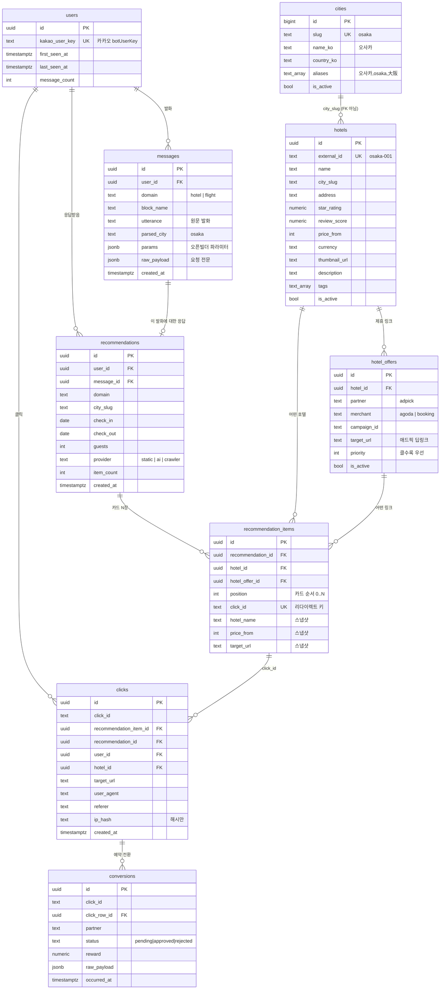

# DB 구조 — 무엇을 어떻게 저장하는가

정의 원본은 [`supabase/migrations/0001_init.sql`](../supabase/migrations/0001_init.sql).
이 문서는 **어떤 데이터가 어느 시점에 어떤 행으로 남는지**를 설명한다.

---

## 1. 한눈에

테이블은 성격에 따라 3덩어리다.

| 그룹 | 테이블 | 누가 쓰나 | 성격 |
|---|---|---|---|
| **마스터** | `cities`, `hotels`, `hotel_offers` | 내가(시드/운영) 넣음 | 잘 안 바뀜. 읽기 위주 |
| **행동 로그** | `users`, `messages`, `recommendations`, `recommendation_items` | 서버가 요청마다 씀 | 계속 쌓임 |
| **성과** | `clicks`, `conversions` | 클릭/제휴사가 씀 | 돈이 되는 지표 |

핵심 한 줄: **발화 1건 → `messages` 1행 → `recommendations` 1행 → `recommendation_items` N행 → (클릭 시) `clicks` 1행 → (예약 시) `conversions` 1행.**

---

## 2. ERD



---

## 3. 실제로 이렇게 쌓인다

사용자가 **"오사카 호텔 추천해줘"** 를 보내고 3번째 카드를 눌렀을 때 남는 행들.

### ① `users` — 처음 본 사용자면 생성, 아니면 재사용

```
id           = 9f1c…(uuid)
kakao_user_key = "abcd1234efgh"    ← 카카오 botUserKey. 이름·전화번호 없음
first_seen_at  = 2026-08-09 14:02
```

> 카카오는 **채널별 익명 키만** 준다. 이름/연락처는 애초에 받을 수 없고, 저장하지도 않는다.

### ② `messages` — "무엇을 요청했는가" 1행

```
user_id     = 9f1c…
domain      = "hotel"
block_name  = "호텔추천"
utterance   = "오사카 호텔 추천해줘"        ← 발화 원문
parsed_city = "osaka"                      ← 서버가 파싱한 결과
params      = {}                           ← 오픈빌더 엔티티
raw_payload = { …요청 전문… }              ← 오픈빌더 디버깅용
```

`parsed_city`가 `null`이면 도시를 못 알아들은 것 → **파싱 실패 사례를 그대로 모을 수 있다.** NLU를 개선할 때 이 행들만 뽑아보면 된다.

### ③ `recommendations` — "어떻게 응답했는가" 1행

```
user_id    = 9f1c…
message_id = ②의 id          ← 요청 ↔ 응답 연결
city_slug  = "osaka"
guests     = null            ← "3명" 같은 표현이 있으면 채워짐
provider   = "static"        ← 나중에 ai/crawler로 바뀌면 성능 비교 가능
item_count = 5
```

### ④ `recommendation_items` — 카드 1장당 1행, 총 5행

| position | click_id | hotel_name | price_from | target_url |
|---|---|---|---|---|
| 0 | `38JR4yL5Vani` | 호텔 한큐 리스파이어 오사카 | 172000 | `https://ad.pick/…?subid=38JR4yL5Vani` |
| 1 | `fZuJ2sSV4Chv` | 칸데오 호텔 오사카 남바 | 138000 | `https://ad.pick/…?subid=fZuJ2sSV4Chv` |
| 2 | `Kd8pQm2Wz1Ry` | 호텔 그란비아 오사카 | 185000 | `https://ad.pick/…?subid=Kd8pQm2Wz1Ry` |
| … | | | | |

이 테이블이 설계의 핵심이다. 3가지를 동시에 한다:

1. **`click_id`** — 카드 버튼 URL(`/r/{click_id}`)의 키. 클릭이 들어오면 여기서 역추적한다.
2. **스냅샷** — `hotel_name` / `price_from` / `target_url` 을 그 시점 값으로 **복사해서** 저장. 나중에 호텔 가격이 바뀌거나 애드픽 캠페인이 교체돼도 *"그때 사용자가 본 화면"* 이 그대로 복원된다. `hotel_id` FK만 있으면 이게 안 된다.
3. **노출 로그** — 클릭 안 된 카드도 남으므로 `position`별 **CTR 계산**이 가능하다.

### ⑤ `clicks` — 사용자가 3번째 카드를 눌렀을 때 1행

```
click_id               = "Kd8pQm2Wz1Ry"
recommendation_item_id = ④의 position=2 행
recommendation_id      = ③의 id
user_id                = 9f1c…
hotel_id               = 호텔 그란비아 오사카
target_url             = "https://ad.pick/…?subid=Kd8pQm2Wz1Ry"
user_agent             = "Mozilla/5.0 (iPhone…"
ip_hash                = "3a7f…"     ← 원본 IP는 저장 안 함. 중복 클릭 판별용 해시만
created_at             = 2026-08-09 14:03
```

**"사용자가 어떤 호텔을 선택했는지"가 바로 이 테이블이다.**

### ⑥ `conversions` — 실제 예약이 일어나면 (Phase 4, 아직 미구현)

애드픽 리포트/포스트백을 받아 `click_id` 로 ⑤와 매칭한다. `target_url` 에 `subid={click_id}` 를 실어 보내는 이유가 이것.

---

## 4. 마스터 테이블

### `hotels` + `hotel_offers` 를 왜 나눴나

호텔 하나에 제휴 링크가 여러 개일 수 있다 — 아고다 캠페인, 부킹 캠페인, 기간 한정 프로모션.
`hotels` 에 `target_url` 컬럼 하나만 두면 이걸 못 담는다.

```
hotels: 호텔 그란비아 오사카
  └ hotel_offers: adpick / agoda   / priority 100 / is_active true   ← 이게 선택됨
  └ hotel_offers: adpick / booking / priority  50 / is_active true
  └ hotel_offers: adpick / agoda   / priority 100 / is_active false  ← 지난 캠페인
```

서버는 `is_active = true` 중 `priority` 가 가장 높은 것 하나를 고른다
([`HotelOfferRepository.best_offer_map`](../app/db/repositories/hotels.py)).
캠페인을 갈아끼울 땐 기존 행을 지우지 말고 `is_active = false` 로 내리면 **과거 클릭 기록의 FK가 살아있다.**

### `cities`

`slug`(`osaka`) 를 키로 `hotels.city_slug`, `messages.parsed_city`, `recommendations.city_slug` 가 전부 연결된다. FK는 안 걸었다 — 나중에 provider가 DB에 없는 도시를 반환해도 응답이 죽지 않게 하려고.

`aliases` 배열은 "동경", "osaka", "大阪" 같은 표기 흔들림을 흡수한다.

> ⚠️ **현재 코드는 `cities` 테이블을 읽지 않는다.** DB 없이도(no-op 모드) 챗봇이 돌아야 해서 [`app/services/nlu.py`](../app/services/nlu.py) 의 `CITIES` 상수를 쓴다. 도시가 늘어나면 **두 곳 다** 고쳐야 한다. 도시 수가 많아지면 그때 DB 조회 + 캐시로 통일하는 게 맞다.

---

## 5. 코드 ↔ 테이블 대응

| 테이블 | 쓰기 | 읽기 |
|---|---|---|
| `users` | [`service.py`](../app/domain/hotel/service.py) 요청마다 upsert | — |
| `messages` | `service.py` 요청마다 insert | — |
| `recommendations` | `service.py` 응답 직전 insert | — |
| `recommendation_items` | `service.py` 카드 조립 시 bulk insert | [`redirect.py`](../app/api/v1/redirect.py) `click_id` 조회 |
| `clicks` | `redirect.py` 리다이렉트 직전 insert | — |
| `hotels` | [`scripts/seed_hotels.py`](../scripts/seed_hotels.py) | `service.py` external_id → id 매핑 |
| `hotel_offers` | `scripts/seed_hotels.py` | `service.py` 최우선 오퍼 |
| `cities` | 마이그레이션 시드 | (미사용 — 위 참고) |
| `conversions` | 미구현 | 미구현 |

**모든 쓰기는 실패해도 예외를 던지지 않는다.** ([`repositories/base.py`](../app/db/repositories/base.py))
DB가 죽어도 사용자는 호텔 목록을 정상적으로 받는다. 대신 그 요청은 기록되지 않는다 — 로깅보다 응답이 우선이라는 판단.

---

## 6. 이 구조로 뽑을 수 있는 것

```sql
-- 도시별 요청 수 (수요가 어디 있나)
select parsed_city, count(*) from messages
where domain = 'hotel' and parsed_city is not null
group by 1 order by 2 desc;

-- 도시를 못 알아들은 발화 (NLU 개선 소스)
select utterance, count(*) from messages
where parsed_city is null group by 1 order by 2 desc limit 50;

-- 호텔별 노출 대비 클릭률(CTR)
select i.hotel_name,
       count(*) as impressions,
       count(c.id) as clicks,
       round(100.0 * count(c.id) / count(*), 1) as ctr
from recommendation_items i
left join clicks c on c.recommendation_item_id = i.id
group by 1 order by ctr desc;

-- 카드 순서(position)가 클릭에 미치는 영향 → 정렬 로직 튜닝 근거
select i.position, count(*) as impressions, count(c.id) as clicks
from recommendation_items i
left join clicks c on c.recommendation_item_id = i.id
group by 1 order by 1;

-- 재방문 사용자
select kakao_user_key, message_count, first_seen_at, last_seen_at
from users where message_count > 1 order by message_count desc;

-- provider 별 클릭률 (static vs ai 비교용, Phase 3에서)
select r.provider, count(distinct r.id) as recs, count(c.id) as clicks
from recommendations r
left join clicks c on c.recommendation_id = r.id
group by 1;
```

---

## 7. 개인정보 / 보안

- 카카오가 주는 건 **채널별 익명 키**(`botUserKey`)뿐이다. 이름·전화번호·이메일은 받지도, 저장하지도 않는다.
- **IP는 원본을 저장하지 않는다.** SHA-256 해시 앞 32자만 (`clicks.ip_hash`) — 중복 클릭 판별용.
- `messages.raw_payload` 에 요청 전문이 들어간다. 지금은 익명 키뿐이라 문제없지만, 나중에 **개인정보 수집 블록을 붙이면 이 컬럼을 마스킹**해야 한다.
- 전 테이블 **RLS 활성 + 정책 없음** = anon / authenticated 키로는 아무것도 못 읽는다. 서버의 `service_role` 키만 통과.
- `service_role` 키는 RLS를 우회한다. **절대 클라이언트에 노출 금지**, 서버 환경변수로만.

---

## 8. 확장 (항공권 등)

`messages.domain` / `recommendations.domain` 컬럼이 이미 `hotel | flight | …` 를 구분한다.
항공권을 붙일 때 **새로 만들 건 `flights` / `flight_offers` 마스터 2개뿐**이고,
`users` · `messages` · `recommendations` · `recommendation_items` · `clicks` 는 그대로 재사용한다.

`recommendation_items.hotel_id` 만 도메인 중립적인 이름(`item_id` + `item_type`)으로 바꾸거나,
`flight_id` 컬럼을 nullable 로 하나 더 두면 된다 — 데이터가 쌓이기 전인 지금이 바꾸기 쉬운 시점이다.
